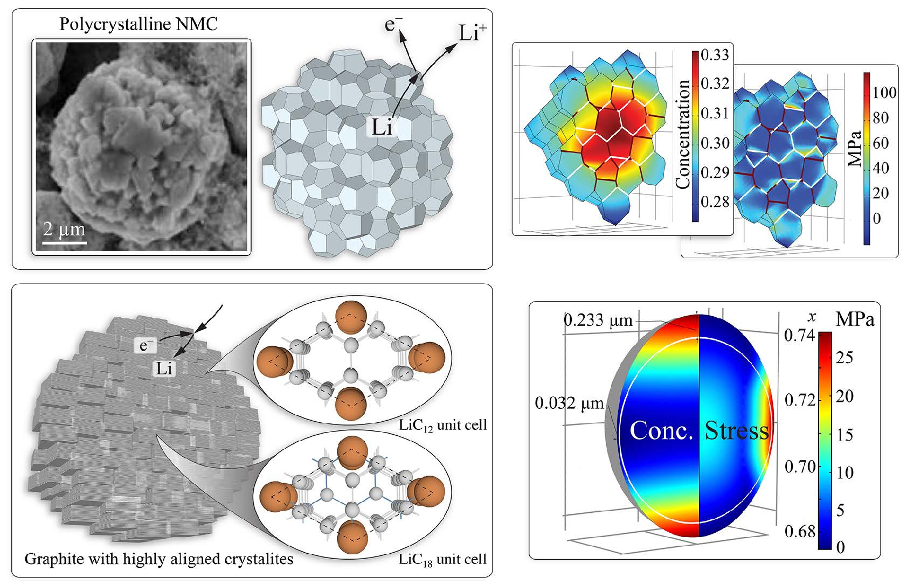
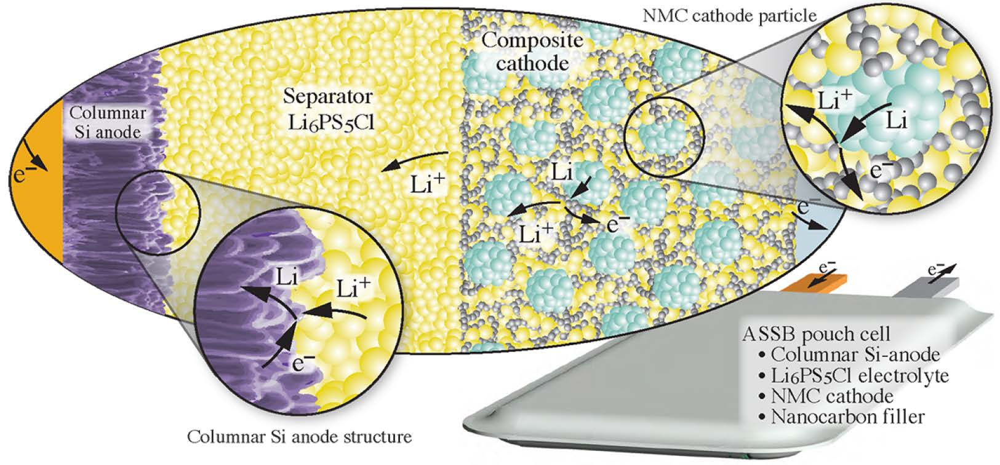
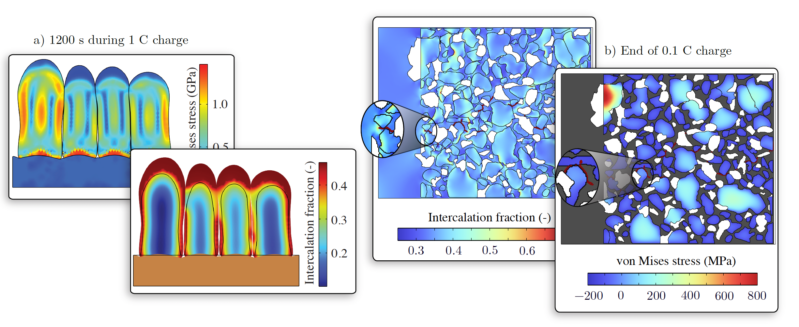
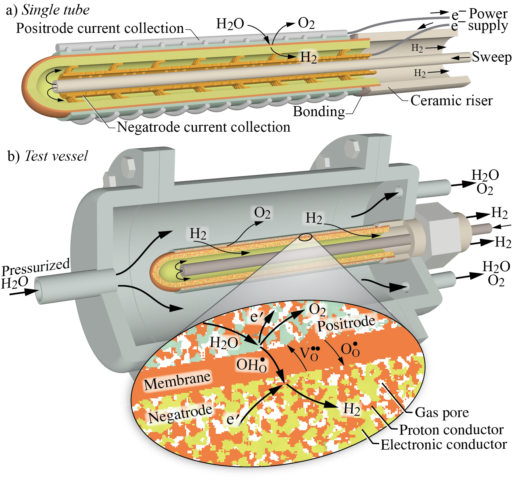

Electrochemical devices — from lithium-ion batteries to protonic ceramic fuel cells — are central to enabling clean energy technologies. Their performance and lifetime depend critically on the **coupling between electrochemical reactions, material transport, mechanics, and microstructure**.  
Our group develops **finite-element–based electro-chemo-mechanical models** to understand these interactions across scales, from active particles to full devices.

---

## **1. Chemo-Mechanical Modeling of Electrode Materials**

We create FEM formulations that capture diffusion-induced stress, anisotropic deformation, and phase-transformation mechanisms in electrode materials such as:

- Polycrystalline NMC cathodes  
- Highly anisotropic electrodes
- Single-crystal and polycrystalline electrodes  
- Silicon anodes with extreme volumetric expansion  

These models resolve transport, mechanics, and interfacial behavior simultaneously, enabling prediction of:

- Stress localization  
- Grain-boundary failure  
- Crack initiation and propagation  
- Degradation mechanisms under fast charging  
- Influence of particle geometry and anisotropy  

---

## **2. All-Solid-State Batteries**

A major research direction focuses on **all-solid-state lithium batteries (ASSBs)**, where solid–solid interfaces introduce fundamentally different deformation and degradation pathways.

Our models incorporate:

- Argyrodite (Li₆PS₅Cl) solid electrolytes  
- Polycrystalline NMC cathodes  
- 3D microstructures from tomography  
- Columnar silicon anodes  
- Interfacial mechanics and decohesion  
- Fabrication pressure and residual stresses  

We simulate:

- Stress evolution during cycling  
- Interfacial delamination  
- Lithium transport in heterogeneous microstructures  
- Particle-scale fracture  
- Influence of microstructure on lifetime  

---

## **3. Protonic Ceramic Membranes & Electrolyzer Materials**

Our group also analyzes protonic ceramics and high-temperature membrane materials, focusing on:

- Coupled thermal–chemical–mechanical behavior  
- Stress generation during hydration/dehydration  
- Interaction between grain boundaries and proton diffusion  
- Failure prediction under long-term cycling  

These models unify transport of protons, oxygen vacancies, and species diffusion with nonlinear mechanics.

---

## **4. Future Directions**

We are expanding our work toward:

- Fracture in sodium-ion and multivalent batteries  
- Fabrication-informed models with residual stresses  
- Phase-field fracture in solid electrolytes  
- High-fidelity, tomography-informed 3D microstructures  
- Multiphysics models of electrolyzers and hydrogen devices  
- Computationally scalable solvers for large-deformation chemo-mechanics  

---

## **5. Impact**

Our methods support materials discovery and device optimization in:

- Energy storage (Li-ion, Na-ion, ASSB)  
- Fuel cells and electrolyzers  
- Hydrogen compression technologies  
- Membrane reactors  
- Solid oxide devices  

The resulting frameworks guide industry and national-lab partners in improving durability, energy density, and safety.

---

This multidisciplinary environment enhances our ability to tackle complex challenges in electrochemical systems modeling.

---

